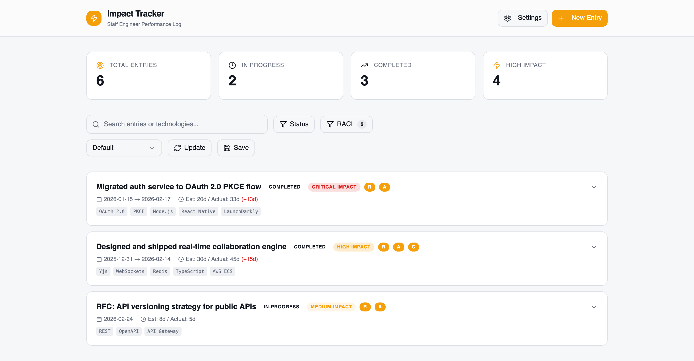
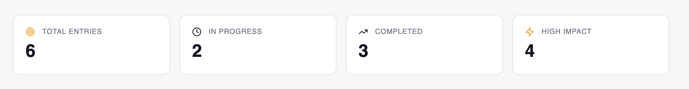
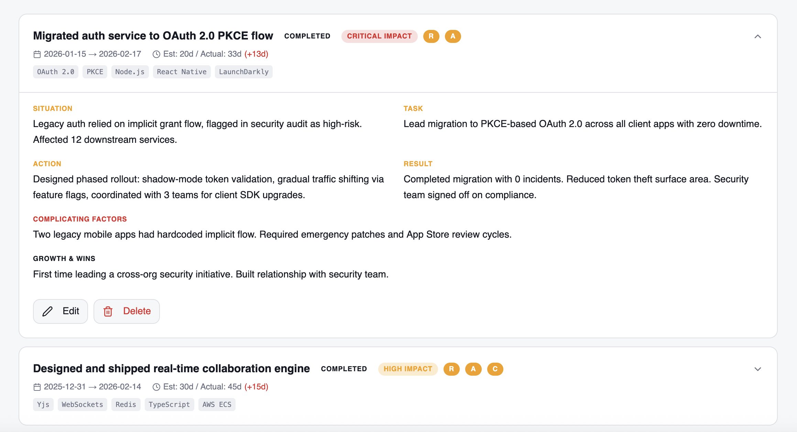

# Impact tracker

Initially vibe-coded through lovable.dev. This is designed to enable software engineers to track their impact within organisations. It's a grounded brag doc.



## Goals

I'm going to try to use this for me, to have better answers for other people and myself.

## Requirements

This system requires a fairly recent nodejs, and enough system privileges to launch a network server. It also requires a web browser, but realistically how are you getting it without one...

## Running

```
npm ci
npm run dev
```

## Building

You can build this code in such a way that it should work for the next several years using bundled artifacts using `npm run build`

> [!WARNING]
> While bundling does ignore the benefits of maintaining the frontend; right now, there is not much benefit, unless you want to add features using the full code.


## Deploying

This has zero server backend requirements. You can use the settings or browser tools in Chrome or Firefox (and derrivatives that do not remove the ability); to manage the state. Folling the [build](./#building) instructions can produce a static output.

> [!IMPORTANT]
> The author cannot see what data you have saved. There is no telemetry; there should be no need for a privacy policy because **the data stays on your device!**

### Config

The project supports import from, and export to state files. When exporting from the system, a checksum is included, to assist with validating data integrity. Removing it, or omitting it, is deemed a deliberate choice.

There are four places that data can be stored.

- tasks.json - intended for just task data; does not support metrics or filters.
- metrics.json - intended for just metrics as data; does not support metrics or filters.
- filters.json - intended for named filters, so that multiple listing views over data can be supported.
- config.json - intended as a single file for the above.

The order should be config.json, and then tasks.json, metrics.json and filters.json if those areas are empty; if these 404 the system should still work.

## Concepts

### Metrics

Metrics provide an _at-a-glance view_ on the total data-set. These are currently not impacted by filters.



### Tasks / Entries

Tasks or Entries are the primary record of the system. This system is designed to be about your own tasks, as entries to the system. The idea is that this will help you to describe your work better to others, be that new-teammembers, senior stakeholders; potential new clients or employers.



### Filters

As you add more data, or get new queries about the impact, you may construct queries and save them so there are less clicks to get to answers and information.
 


## Testing

Very basic tests were established to stop the LLMs from breaking things, or confusing themselves. It worked, but the suite is not as mature as it could be. If you are passionate about testing, feel free; I'm not yet sure if it is worth the investment.

## Systems

If you can get by and writing free-form works for you, this system may not be; it is rigid, prescriptive and aims to use systems from others. It tracks progress, allows filtering, views and metrics.

### STAR

This heavily emphasises using S.T.A.R framework for describing using situation, task, actions, and results.

### RACI

This system also uses R.A.C.I for conveying role in terms of being responsible, accountable, consulted or informed.

| Role                  | Definition                              | Domain Fit                                                                           |
| --------------------- | --------------------------------------- | ------------------------------------------------------------------------------------ |
| **R** — *Responsible* | Does the actual work                    | **Tactical** (execution), **Deep expertise** (specialist doing the task)             |
| **A** — *Accountable* | Owns the outcome, makes final decisions | **Strategic** (sets direction), **Management** (the single throat to choke)          |
| **C** — *Consulted*   | Provides input before decisions         | **Deep expertise** (advisory specialists), **Strategic** (stakeholders with context) |
| **I** — *Informed*    | Kept updated on progress                | **Management** (visibility without veto), often cross-functional leads               |

